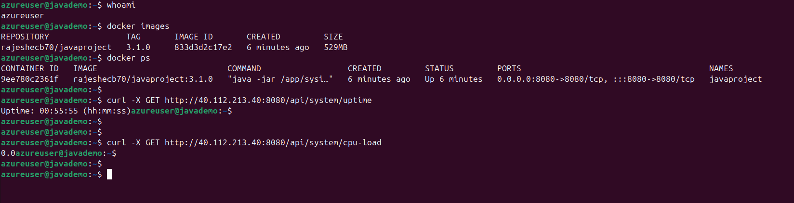

## Java CI Pipeline with Docker and Azure Deployment

### Project Objective

This project automates the process of building, validation, testing, and deploying a Java application using Docker and Azure. The pipeline, powered by GitHub Actions, ensures that when changes are pushed to the `main` branch, the application is built, tested, and deployed to an Azure server with Docker. It also allows easy access to monitor the server's CPU and uptime metrics.

### Prerequisites

Before using this project, ensure the following prerequisites are set up:

#### 1. **Docker**
   - Install Docker on your local machine and on the Azure server where the application will be deployed.
   - Follow the official Docker installation guide: [Install Docker](https://docs.docker.com/engine/install/ubuntu/).

#### 2. **Azure Server Setup**
   - Set up an Azure virtual machine (VM) or server to deploy the application.
   - Ensure SSH access is enabled with a valid user who has the necessary privileges to run Docker commands.

#### 3. **GitHub Secrets Configuration**
   You must configure the following secrets in your GitHub repository to securely store credentials:
   - `DOCKERHUB_USERNAME`: Your DockerHub username.
   - `DOCKERHUB_TOKEN`: Your DockerHub access token/password.
   - `AZURE_SERVER_USERNAME`: The username for your Azure server.
   - `AZURE_SERVER_PASSWORD`: The password for SSH access to the Azure server.
   - `AZURE_SERVER_IP`: The IP address of your Azure server.
   - `DOCKER_USER`: This is the docker reponame.

#### 4. **Makefile**
   The repository includes a `Makefile` that automates common tasks. Ensure it includes:
   - `make install`: Installs the required dependencies for the java project.
   - `make test`: Runs unit and integration tests to ensure the application functions correctly.
   - `make docker-build`: Build the docker image(artifact) using the Dockerfile and tag it.
   - `make docker-push`: Push the docker image (artifact) in dockerHub.
   - `make docker-run`: Run the application locally.

### Setup and Configuration

#### 1. **GitHub Actions CI Pipeline**
   The project uses GitHub Actions to automate the CI/CD pipeline. The pipeline is defined in `.github/workflows/java-CI-Pipeline.yml`.

   The pipeline consists of the following steps:
   1. **Checkout code**: Pulls the latest code from the repository.
   2. **Set up jdk environment**: Sets up Jdk 21.x using the `actions/setup-java@v3` action.
   3. **Install dependencies**: Executes `make install` to install project dependencies.
   4. **Run validate**: Executes `make validate` to run validation checks.
   5. **Run tests**: Executes `make test` to run the test suite.
   6. **Docker login**: Logs into DockerHub using credentials stored as GitHub secrets.
   7. **Docker build and push**: Builds the Docker image and pushes it to DockerHub with a dynamic tag (`1.0.0` by default).
   8. **Deploy to Azure**: SSHs into the Azure server, installs Docker if necessary, pulls the latest Docker image, and restarts the Docker container with the updated image.

#### 2. **Deploying to Azure**
   The CI pipeline deploys the application to Azure by SSH-ing into the server and performing the following:
   - Installing Docker (if it's not already installed).
   - Pulling the latest Docker image from DockerHub (`$DOCKER_USER/$DOCKER_IMAGE:$TAG`).
   - Running the Docker container with the latest image on port `8080`.

   If Docker is not installed on the Azure server, the pipeline automatically installs it using a set of commands in the workflow.

#### 3. **Running the Project Locally**
   To run the java application locally, follow these steps:

   1. Clone the repository:
      ```bash
      git clone https://github.com/rajeshecb70/java-project.git
      cd java-project/sysinfo
      ```

   2. Install dependencies:
      ```bash
      make install
      ```

   3. Build docker image:
      ```bash
      make docker-build
      ```
   4. Run the application using the docker images:
      ```bash
      make docker-run
      ```
      The application will be available at `http://localhost:8080/api/system/uptime` `http://localhost:8080/api/system/cpu-load`

#### 4. **Updating the Docker Image**
   To update the Docker image version, modify the `TAG` environment variable in the `.github/workflows/java-CI-Pipeline.yml` file. For example, change the `TAG` value from `1.0.0` to a new version like `2.0.0`:
   ```yaml
   env:
     TAG: 3.2.0
   ```
#### 5. **Accessing the Application: You can access two important endpoints**
```yaml
# CPU Metrics:
http://<Server_IP>:8080/api/system/uptime
# Uptime Metrics
http://<Server_IP>:8080/api/system/cpu-load
```
#### 5. **Image snapshots**
Pipeline: 

Java_app on AzureServer: 

CPU_Info: 


Uptime_Info: 

